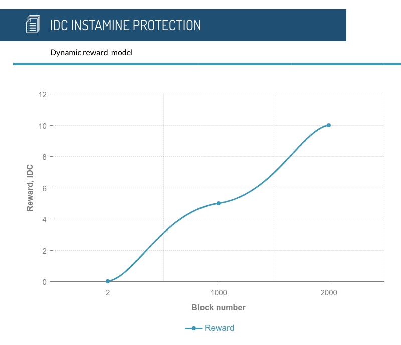
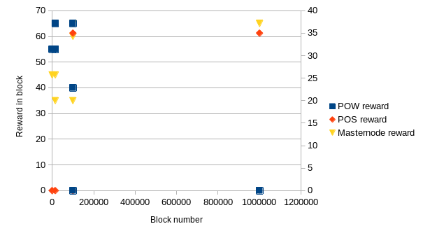

"YOUR FINANCE FREEDOM"

IDC-Core is GNU AGPLv3 licensed.

[Website](https://www.id-chain.org) — [Block Explorer](https://explorer.id-chain.org/) — [Blog](https://www.reddit.com/user/ID_Chain) — [Forum](https://bitcointalk.org/index.php?topic=____________) — [Telegram](https://t.me/IDC-Official) — [Twitter](https://twitter.com/IDChain_Team)

Features
=============

* Static PoS
* Segwit

The IDC-Core Project is a decentralized peer-to-peer banking financial platform, created under an open source license, featuring a built-in cryptocurrency, end-to-end encrypted messaging and decentralized marketplace. The decentralized network aims to provide anonymity and privacy for everyone through a simple user-friendly interface by taking care of all the advanced cryptography in the background.

## Coin Specifications

| **Specification** | **Value** |
|:-----------|:-----------|
| Hashing algo | `NIST5` |
| Total Blocks | `n/a (infinite)` |
| Block Size | `1MB` |
| Block Time | `120s` |
| PoW Block Time | `120s`   |
| PoW Reward | `10 IDC` |
| PoS Reward | `10 IDC` |
| Stake Time | `48 hours` |
| Masternode Requirement | `20,000 IDC` |
| Masternode Reward | `35%/60% PoW/PoS` |
| Port | `31569` |
| RPC Port | `40896` |
| Masternode Port | `31569` |
| IDC legacy address start with | `D` |
| Segwit | `yes` |
| Segwit address ticker | `idc` |
| Segwit activation | `January, 20 2020` |
| Premine | `1 million IDC` |

## Instamine protection

Yes, IDC include instamine protection, more details you can find on chart below:

## Important POS information

POS Staking Requirements

| **Reqirement** | **Details** |
|:-----------|:-----------|
|Confirmations | 300 blocks |
| Amount | starting 100 IDC |
|Wallet| Unlocked |

POS Block rewards distribution

| **Subsidy** | **Block** | **Reward split**   MN/ POS| **Notes** |
|:------------|:----------|:-----------------|:----------|
| 10 IDC | 99999 | 35/65%% | After POS start block time will be decreased |
| 10 IDC | 100000 | 60/40%% | On 100000 Block we are going to change reward |

## Rewards changes

Here is 2 charts which are show you rewards changes in IDC 2.0:

Instructions
-----------

### Building for 32-bit Windows

The next three steps are an example of how to acquire the source and build in an appropriate way.

Acquire the source and install dependencies.

    git clone https://gitlab.com/ID-Chain/idc-core.git
    sudo chmod -R a+rw idc-core
    cd idc-core/depends
    ./install-dependencies.sh

Set the default mingw-w32 g++ compiler option to auto (option 0) by default.

    sudo update-alternatives --config i686-w64-mingw32-g++

Build in the usual way.

    ./build-wins.sh

### Building for 64-bit Windows   

The next three steps are an example of how to acquire the source and build in an appropriate way.

Acquire the source and install dependencies.

    git clone https://gitlab.com/ID-Chain/idc-core.git
    sudo chmod -R a+rw idc-core
    cd idc-core/depends
    ./install-dependencies.sh

Set the default mingw-w64 g++ compiler option to posix (option 1).

    sudo update-alternatives --config x86_64-w64-mingw32-g++

Build in the usual way.

    ./build-wins.sh x64

### Build on Ubuntu

Use

    sudo add-apt-repository ppa:bitcoin/bitcoin; git clone https://gitlab.com/ID-Chain/idc-core.git; cd idc-core; depends/install-dependencies.sh; ./autogen.sh; ./configure --disable-tests --with-boost-libdir=/usr/local/lib; make clean; make -j$(nproc)

Add bitcoin repository for Berkeley DB 4.8

    sudo add-apt-repository ppa:bitcoin/bitcoin

Clone IDC-Core repository

    git clone https://gitlab.com/ID-Chain/idc-core.git

Build IDC-Core

    cd idc-core
    ./depends/install-dependencies.sh
    ./autogen.sh
    ./configure --disable-tests
    make -j$(nproc)

Development Process
-------------------

The `master` branch is regularly built and tested, but is not guaranteed to be
completely stable. [Tags](https://gitlab.com/ID-Chain/idc-core/tags) are created
regularly to indicate new official, stable release versions of IDC-Core.

The contribution workflow is described in [CONTRIBUTING.md](CONTRIBUTING.md).

Testing
-------

Testing and code review is the bottleneck for development; we get more pull
requests than we can review and test on short notice. Please be patient and help out by testing
other people's pull requests, and remember this is a security-critical project where any mistake might cost people
lots of money.

### Automated Testing

Developers are strongly encouraged to write [unit tests](src/test/README.md) for new code, and to
submit new unit tests for old code. Unit tests can be compiled and run
(assuming they weren't disabled in configure) with: `make check`. Further details on running
and extending unit tests can be found in [/src/test/README.md](/src/test/README.md).

There are also [regression and integration tests](/qa) of the RPC interface, written
in Python, that are run automatically on the build server.
These tests can be run (if the [test dependencies](/qa) are installed) with: `qa/pull-tester/rpc-tests.py`

### Manual Quality Assurance (QA) Testing

Changes should be tested by somebody other than the developer who wrote the
code. This is especially important for large or high-risk changes. It is useful
to add a test plan to the pull request description if testing the changes is
not straightforward.

### Issue

 We try to prompt our users for the basic information We always need for new issues.
 Please fill out the issue template below and submit it to our discord channel

  

 [ISSUE_TEMPLATE](doc/template/ISSUE_TEMPLATE_example.md)

## License information

